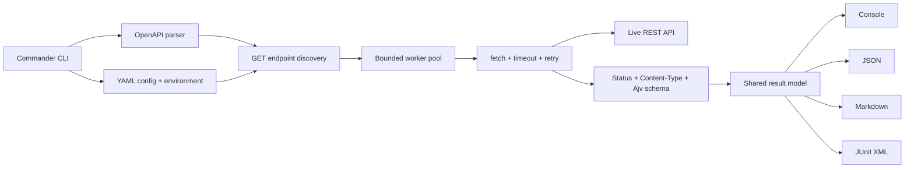

# API Contract Checker

[](https://github.com/German4341374/api-contract-checker/actions/workflows/ci.yml)
[](LICENSE)
[](https://nodejs.org/)

`api-contract-checker` is a focused TypeScript CLI that sends safe `GET` requests to a live REST API and compares its responses with an OpenAPI 3.x document. It is designed for smoke-level contract verification in local development and CI: failures explain the expected status, media type, or schema value and return a non-zero exit code.

The project intentionally implements a documented subset of OpenAPI. It is not a complete request generator or conformance implementation.

## Use cases

- Catch response drift after an API deployment.
- Add a fast black-box contract gate to CI.
- Verify required fields, nested values, arrays, enums, and nullable fields.
- Export human-readable Markdown or machine-readable JSON and JUnit results.
- Exercise parameterized paths with safe fixture identifiers.

## Architecture



The parser validates and dereferences the document. Discovery resolves supported paths before any request is sent. A bounded worker pool then executes checks, and every reporter renders the same immutable result model.

## Requirements

- Node.js 24.14.1 or another compatible Node.js 24 release
- npm 11 or later
- Docker for the container workflow (optional)

The commands work in Linux and Windows through WSL2. Dependency versions and the Node.js container tag are pinned.

## Install and build

```bash
git clone https://github.com/German4341374/api-contract-checker.git
cd api-contract-checker
npm ci
npm run build
npm link
api-contract-checker --help
```

During development, the CLI can be run without a global link:

```bash
node dist/cli.js check openapi.yaml --base-url http://localhost:3000
```

## Commands

```bash
api-contract-checker check openapi.yaml --base-url http://localhost:3000
api-contract-checker check openapi.yaml --report junit --base-url http://localhost:3000
api-contract-checker check openapi.yaml --config checker.yaml
api-contract-checker check openapi.json --report markdown --output contract-report.md
```

Useful options:

| Option              | Purpose                                    |   Default |
| ------------------- | ------------------------------------------ | --------: |
| `--base-url <url>`  | API base URL; overrides config             |  required |
| `--config <path>`   | Checker YAML file                          |      none |
| `--timeout <ms>`    | Timeout for each request                   |    `5000` |
| `--concurrency <n>` | Maximum concurrent requests                |       `4` |
| `--retries <n>`     | Retries for 502, 503, and 504              |       `2` |
| `--report <format>` | `console`, `json`, `markdown`, or `junit`  | `console` |
| `--output <path>`   | Write instead of printing the report       |    stdout |
| `--verbose`         | Print sanitized request metadata to stderr |  disabled |

Exit codes:

- `0` — all executed checks passed.
- `1` — one or more requests or contract checks failed.
- `2` — invalid input, configuration, specification, or output.

Skipped unsupported endpoints do not fail the run and are always explained in the report.

## Configuration

```yaml
baseUrl: http://localhost:3000
timeoutMs: 3000
concurrency: 4
retries: 2

pathParameters:
  /users/{userId}:
    userId: 42
  "GET /teams/{teamId}":
    teamId: demo-team

headers:
  Authorization: API_AUTHORIZATION
  X-API-Key: API_KEY

ignore:
  operations:
    - GET /internal/diagnostics
  checks:
    GET /legacy/status:
      - content-type
      - schema
```

`headers` maps an HTTP header name to an environment variable name; it never contains the header value. Export values in the shell before running:

```bash
export API_AUTHORIZATION="Bearer local-test-token"
export API_KEY="local-test-key"
api-contract-checker check openapi.yaml --config checker.yaml --verbose
```

PowerShell:

```powershell
$env:API_AUTHORIZATION = "Bearer local-test-token"
$env:API_KEY = "local-test-key"
api-contract-checker check openapi.yaml --config checker.yaml --verbose
```

The checker does not automatically load `.env` files. `.env.example` documents a placeholder only.

Ignore only known, reviewed differences. Broad ignore rules can hide breaking changes.

## Demo

The demo has one valid endpoint, one endpoint returning the wrong status, and one endpoint returning a response with missing and incorrectly typed fields.

Terminal 1:

```bash
npm ci
npm run demo:server
```

Terminal 2:

```bash
npm run build
node dist/cli.js check demo/openapi.yaml --config demo/checker.yaml
```

Expected summary:

```text
[PASS] GET /healthy
[FAIL] GET /wrong-schema
[FAIL] GET /wrong-status

Summary: 1 passed, 2 failed, 0 skipped (3 total)
```

The demo intentionally exits with code `1` because it demonstrates detected contract failures.

Generate each report format:

```bash
node dist/cli.js check demo/openapi.yaml --config demo/checker.yaml --report json --output report.json
node dist/cli.js check demo/openapi.yaml --config demo/checker.yaml --report markdown --output report.md
node dist/cli.js check demo/openapi.yaml --config demo/checker.yaml --report junit --output report.xml
```

## Supported OpenAPI subset

Supported:

- OpenAPI `3.x` YAML and JSON documents.
- `GET` operations only.
- Paths without required path parameters, or paths whose values are supplied in checker YAML.
- The first explicit numeric `2xx` response, sorted by status code.
- Exact response media type comparison with optional charset parameters ignored.
- JSON bodies.
- Non-circular local and external `$ref` values resolved by the parser.
- JSON Schema-style `type`, `properties`, `required`, `additionalProperties`, `enum`, arrays and `items`, nested objects, `allOf`, `anyOf`, `oneOf`, standard string/number constraints, and formats supported by Ajv Formats.
- OpenAPI 3.0 `nullable: true`.

Not supported:

- Swagger/OpenAPI 2.0.
- Methods other than `GET`.
- Automatic query, header, cookie, or request-body example generation.
- Automatic OpenAPI security scheme or OAuth flows.
- Wildcard status keys such as `2XX` or `default` as the expected success response.
- Multiple example-driven requests for one operation.
- Full content negotiation, callbacks, links, webhooks, and discriminator behavior.
- Circular/recursive schemas.

Required query parameters are not generated. Supply a query directly through a concrete server path or expose a fixture endpoint for CI.

## Validation behavior

For every discovered operation, the checker:

1. builds the URL and applies configured path values;
2. sends a `GET` request with a bounded timeout;
3. retries only HTTP 502, 503, and 504 with exponential backoff;
4. compares the numeric status;
5. compares the response `Content-Type` without charset parameters;
6. parses JSON and validates the response against the selected schema;
7. reports expected and actual values with a JSON path.

`Authorization`, `Cookie`, and `Set-Cookie` headers are redacted in verbose logs. Sensitive URL parameters named `token`, `key`, `password`, or `secret` are also masked. Response bodies are not printed wholesale; individual invalid values can appear in diffs and reports.

## Testing

```bash
npm run format:check
npm run lint
npm run typecheck
npm test
npm run test:coverage
npm run build
```

Or run the complete local gate:

```bash
npm run check
```

Tests cover schema primitives, required fields, enums, nullable values, arrays, nested objects, masking, configuration, discovery, reporters, timeout behavior, retries, and a live in-process mock HTTP API.

## Docker

Build the multi-stage, non-root image:

```bash
docker build --tag api-contract-checker:local .
docker run --rm api-contract-checker:local --help
```

Check a service running on the host from Linux:

```bash
docker run --rm \
  --add-host host.docker.internal:host-gateway \
  --volume "$PWD:/work:ro" \
  api-contract-checker:local \
  check /work/demo/openapi.yaml \
  --base-url http://host.docker.internal:3000
```

Docker Desktop already provides `host.docker.internal`. Mount specifications read-only and do not bake credentials into an image.

## CI example

After installing the package in a pipeline:

```yaml
- name: Check test deployment
  env:
    API_AUTHORIZATION: ${{ secrets.TEST_API_AUTHORIZATION }}
  run: |
    api-contract-checker check openapi.yaml \
      --config checker.ci.yaml \
      --report junit \
      --output contract-results.xml
```

The command exits `1` on a contract mismatch, so the job fails naturally. See [CI integration](docs/ci.md) for artifact handling and the repository workflow.

## Security notes

- Use read-only, least-privilege API credentials.
- Check only systems you are authorized to access.
- Keep secret values in environment variables or a CI secret store.
- Never commit reports from private APIs without reviewing their mismatch values.
- Use low concurrency against shared or rate-limited environments.
- Treat redirects as calls to the redirect target; review the tested base URL.

See [SECURITY.md](SECURITY.md) for reporting and operational guidance.

## Project structure

```text
src/
  cli.ts             command parsing and exit codes
  config.ts          YAML validation and environment headers
  openapi.ts         validation, dereferencing, and discovery
  http.ts            timeout and retry behavior
  runner.ts          concurrency and contract checks
  schema.ts          OpenAPI-to-Ajv schema validation
  reporters/         console, JSON, Markdown, and JUnit
  demo/              local mock API
tests/               unit and integration tests
demo/                example OpenAPI document and checker config
docs/                design and CI decisions
```

## Limitations

- The tool does not synthesize arbitrary valid requests, so it cannot safely explore every OpenAPI operation.
- Schema diffs can expose individual response values; protect CI artifacts accordingly.
- In-memory execution is suitable for smoke suites, not very large load tests.
- Retry settings are global rather than per operation.
- JSON is the only schema-validated response body format.

## Roadmap

- Optional query parameter fixtures.
- Per-operation timeout and retry policies.
- Response header assertions.
- SARIF report output.
- Pluggable redaction rules for schema diffs.

## License

[MIT](LICENSE)
